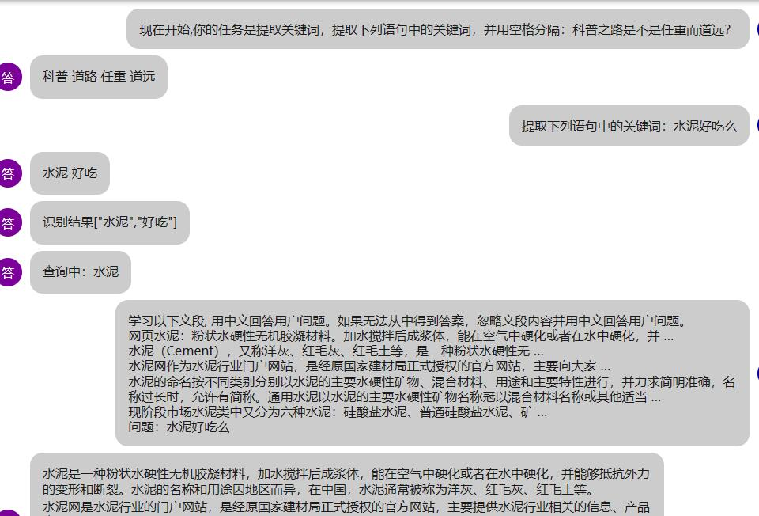
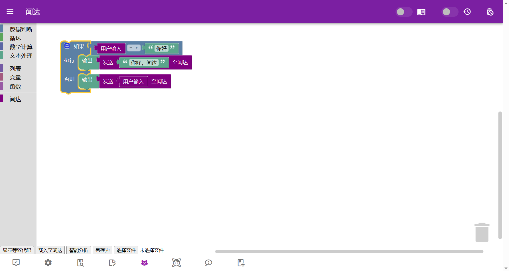
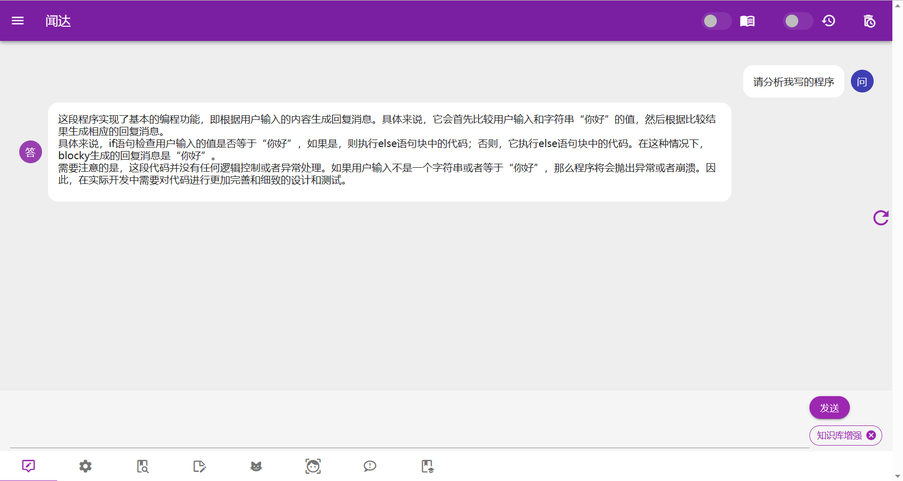
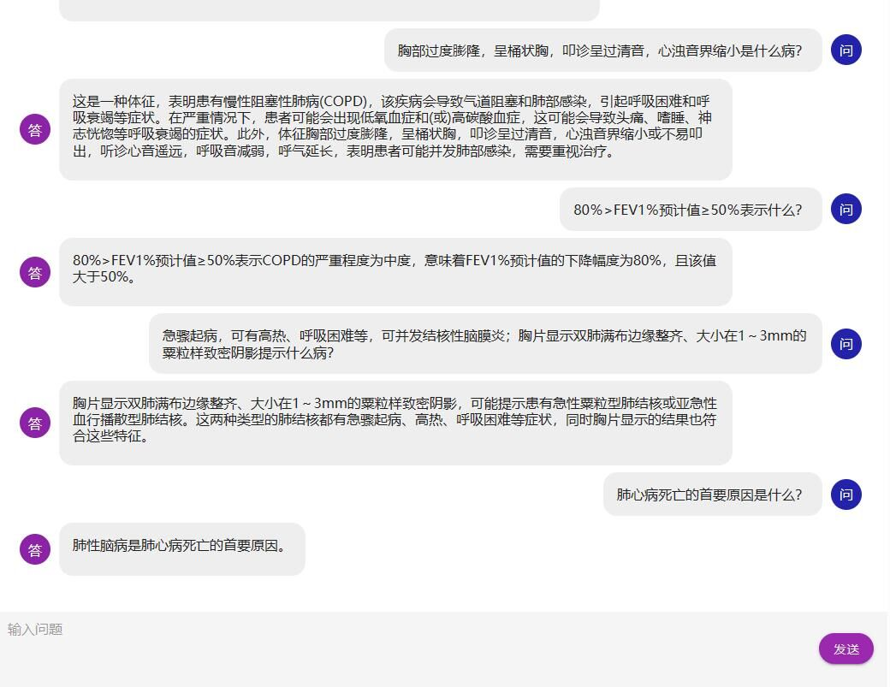

# Wendada: A Large-scale Language Model Invocation Platform
This project aims to achieve efficient content generation for specific contexts while considering the limited computing resources of individuals and small to medium-sized enterprises, as well as concerns about knowledge security and privacy. To achieve this goal, the platform integrates the following capabilities:

1. Knowledge Base: Supports integration with various sources such as [Local Offline Vector Libraries][rtst mode](#rtst-mode), [Local Search Engines][Fess Mode](#fess-mode) and online search engines.
2. Multiple Large Language Models: Currently supports offline deployment models like `chatGLM-6B\chatGLM2-6B`、`chatRWKV`、`llama系列(not recommended for Chinese users)`、`moss(not recommended)`、`baichuan(requires lora for optimal results)`、`Aquila-7B`、`InternLM`, and online API access to `openai api` and `chatGLM-130b api`。
3. Auto Scripts: By developing JavaScript scripts as plugins, the platform is extended to include various automation features, such as customizing dialogue flow, accessing external APIs, and switching LoRA models online.
4. Other Practical Capabilities: Dialogue history management, intranet deployment, multi-user simultaneous usage, etc.


Communication QQ Groups: LLM Usage and General Discussion Group`162451840`;Knowledge Base Usage Discussion Group `241773574(full, please go to QQ Channel for discussion)`full, please go to QQ Channel for discussion`744842245`；[QQ Channel](https://pd.qq.com/s/ej03plxks)

<!--ts-->
- [Wendada: A Large-scale Language Model Invocation Platform](#wendada-a-large-scale-language-model-invocation-platform)
  - [Installation and Deployment](#installation-and-deployment)
    - [Description of Various Models](#description-of-various-models)
    - [Lazy Package](#lazy-package)
      - [Baidu Cloud](#baidu-cloud)
      - [Quark](#quark)
      - [Introduction](#introduction)
    - [Manual Installation](#manual-installation)
      - [Step 1: Install Dependencies](#step-1-install-dependencies)
      - [Step 2: Download Models](#step-2-download-models)
      - [Step 3: Parameter Configuration](#step-3-parameter-configuration)
  - [Auto](#auto)
    - [List of Auto Development Functions](#list-of-auto-development-functions)
    - [Code Segments Related to Auto Development](#code-segments-related-to-auto-development)
    - [Partial Built-in Auto Usage Instructions](#partial-built-in-auto-usage-instructions)
  - [Knowledge Base](#knowledge-base)
    - [rtst mode](#rtst-mode)
    - [Using Fine-tuned Models to Improve Knowledge Base Answer Accuracy](#using-fine-tuned-models-to-improve-knowledge-base-answer-accuracy)
    - [Models](#models)
    - [Fess Mode](#fess-mode)
    - [Knowledge Base Debugging](#knowledge-base-debugging)
    - [Cleaning Knowledge Base Files](#cleaning-knowledge-base-files)
  - [Model Configuration](#model-configuration)
    - [chatGLM-6B/chatGLM2-6B](#chatglm-6bchatglm2-6b)
    - [chatRWKV](#chatrwkv)
      - [torch](#torch)
      - [cpp](#cpp)
    - [Aquila-7B](#aquila-7b)
- [Secondary Development Based on this Project](#secondary-development-based-on-this-project)
  - [wenda-webui](#wenda-webui)
  - [Word Document Software Integration](#word-document-software-integration)

<!-- Created by https://github.com/ekalinin/github-markdown-toc -->
<!-- Added by: runner, at: Sun May 14 12:45:00 UTC 2023 -->

<!--te-->


## Installation and Deployment
### Description of Various Models
| Feature                                             | Multi-User Support | Stream Output   | CPU            | GPU | Quantization Support               | LoRa Integration |
| ------------------------------------------------ | ---------- | ---------- | -------------- | --- | ------------------ | -------- |
| [chatGLM-6B/chatGLM2-6B](#chatglm-6bchatglm2-6b) | √          | √          | Requires Compiler   | √   | Pre-quantization and Online Quantization	 | √        |
| RWKV [torch](#torch)                             | √          | √          | √              | √   | Pre-quantization and Online Quantization |          |
| RWKV.[cpp](#cpp)                                 | √          | √          | Instruction Set Acceleration Available |     | Pre-quantization           |          |
| Baichuan-7B                                      | √          | √          | √              | √   |                    | √        |
| Baichuan-7B (GPTQ)                               | √          | √          |                | √   | Pre-quantization           |          |
| [Aquila-7B](#aquila-7b)                          |            | 	Not Implemented	 | √              | √   |                    |          |
| replit                                           |            |            | √              | √   |                    |          |
| chatglm130b api                                  | √          |            |                |     |                    |          |
| openai api                                       | √          | √          |                |     |                    |          |
| llama.cpp                                        | √          | √          | Instruction Set Acceleration Available |     | Pre-quantization           |          |
| llama torch                                      | √          | √          | √              | √   | Pre-quantization and Online Quantization |          |
| InternLM                                         | √          | √          | √              | √   | Online Quantization           |          |
### Lazy Package
#### Baidu Cloud
https://pan.baidu.com/s/1idvot-XhEvLLKCbjDQuhyg?pwd=wdai 

#### Quark
Link:https://pan.quark.cn/s/c4cb08de666e
Extract Code:4b4R
#### Introduction
Default parameters work well on devices with 6GB VRAM. The latest version of the lazy package has integrated a one-click update feature, which is recommended to be updated before use.

Usage steps (using the glm6b model as an example):
1. Download the lazy package and model. The model can be downloaded using the built-in script from HuggingFace (HF) or from a cloud drive.
2. If CUDA 11.8 is not installed, download and install it from the cloud drive.
3. Double-click on 运行GLM6B.bat (Run GLM6B.bat).
4. If you need to generate an offline knowledge base, refer to[知识库](#知识库)。
### Manual Installation
PS:Be sure to check [example.config.yml](https://github.com/l15y/wenda/blob/main/example.config.yml),which provides more detailed explanations of each feature!
#### Step 1: Install Dependencies
Common dependencies:```pip install -r requirements/requirements.txt```
Configure according to the[知识库](#知识库)being used.

#### Step 2: Download Models
Download the corresponding model based on your needs.

Recommended to use the RWKV-4-Raven-7B-v11 model for chatRWKV or chatGLM-6B.

#### Step 3: Parameter Configuration
Rename[example.config.yml](https://github.com/l15y/wenda/blob/main/example.config.yml) to `config.yml` and fill in the model download location and other necessary information according to the parameter instructions inside the file.

## Auto
Auto functionality is achieved through JavaScript scripts, which are injected into the program as plugins using Greasemonkey scripts or placed directly in the `autos` directory. This extends Wendada with various automation features.

### List of Auto Development Functions
| Function (All are asynchronous calls)           | Functionality                                  | Explanation                                                                |
| ------------------------------- | ------------------------------------- | ------------------------------------------------------------------- |
| send(s,keyword = "",show=true)  | Send information to LLM and return the model's response as a string | s: Input model text; keyword: Text displayed in the chat interface; show: Whether to display in the chat interface |
| add_conversation(role, content) | Add conversation information                          | role: 'AI' or 'user'; content: string                                 |
| save_history()                  | Save conversation history                          | Automatically saves after each conversation, but manually added conversations need to be saved manually                    |
| find(s, step = 1)               | Search in the knowledge base                          | Returns a JSON array                                                        |
| find_dynamic(s,step=1,paraJson) | Search in the dynamic knowledge base; see Wendada Notes Auto for reference    | paraJson：{libraryStategy:"sogowx:3",maxItmes:2}                    |
| zsk(b=true)                     | Toggle knowledge base                            |                                                                     |
| lsdh(b=true)                    | Toggle history dialogue                          | Knowledge base should be closed when opening                                              |
| speak(s)                        | Use TTS engine to read text                 | Calls the system's TTS engine                                                        |
| copy(s)                         | Copy text using `clipboard-write` in the browser   | Requires relevant permissions                                                        |
### Code Segments Related to Auto Development
Add content in the left-side feature bar:
```
func.push({
    name: "Name",
    question: async () => {
        let answer=await send(app.question)
        alert(answer)
    },
})
```
Add content in the lower tab:
```
app.plugins.push({ icon: 'note-edit-outline', url: "/static/wdnote/index.html" })
```
Search in a specific RTST knowledge base:
```
find_in_memory = async (s, step, memory_name) => {
   response = await fetch("/api/find_rtst_in_memory", {
      method: 'post',
      body: JSON.stringify({
         prompt: s,
         step: step,
         memory_name: memory_name
      }),
      headers: {
         'Content-Type': 'application/json'
      }
   })
   let json = await response.json()
   console.table(json)
   app.zhishiku = json
   return json
}
```
Upload to a specific RTST knowledge base:
```
upload_rtst_zhishiku = async (title, txt,memory_name) => {
   response = await fetch("/api/upload_rtst_zhishiku", {
      method: 'post',
      body: JSON.stringify({
         title: title,
         txt: txt,
         memory_name: memory_name
      }),
      headers: { 'Content-Type': 'application/json' }
   })
   alert(await response.text())
}
```
Save a specific RTST knowledge base:
```
save_rtst = async (memory_name) => {
   response = await fetch("/api/save_rtst_zhishiku", {
      method: 'post',
      body: JSON.stringify({
         memory_name: memory_name
      }),
      headers: { 'Content-Type': 'application/json' }
   })
   alert(await response.text())
}
```
Access SD_agent:
```
response = await fetch("/api/sd_agent", {
   method: 'post',
   body: JSON.stringify({
         prompt: `((masterpiece, best quality)), photorealistic,` + Q,
         steps: 20,
         // sampler_name: "DPM++ SDE Karras",
         negative_prompt: `paintings, sketches, (worst quality:2), (low quality:2), (normal quality:2), lowres, normal quality, ((monochrome)), ((grayscale)), skin spots, acnes, skin blemishes, age spot, glans`
   }),
   headers: {
         'Content-Type': 'application/json'
   }
})
try {
   let json = await response.json()
   add_conversation("AI", '")
} catch (error) {
   alert("Failed to connect to the SD API. Please make sure the agents library is enabled and set the SD API address to 127.0.0.1:786.")
}
```
### Partial Built-in Auto Usage Instructions
| File Name               | Functionality                                                                                |
| -------------------- | ----------------------------------------------------------------------------------- |
| 0-write_article.js   | Write an article based on a title or outline                                                        |
| 0-zsk.js             | Enhance and manage the knowledge base                                                                    |
| face-recognition.js  | 	Pure browser-based face detection: Control voice input by recognizing mouth movements. Only available locally or under TLS due to browser limitations. |
| QQ.js                | 	Pure browser-based face detection: Control voice input by recognizing mouth movements. Only available locally or under TLS due to browser limitations.                                                    |
| block_programming.js | easy block programming: Implement simple Auto features by dragging blocks                             |
| 1-draw_use_SD_api.js | Call the Stable Diffusion interface for drawing using the agents module (see example.config.yml `<Library>`)       |

Call the Stable Diffusion interface for drawing using the agents module (see example.config.yml `<Library>`)





[Auto examples](https://github.com/l15y/wenda/tree/main/autos)

## Knowledge Base
The knowledge base principle is to generate some prompt information and insert it into the dialogue after searching, so that the model becomes aware of the knowledge base data. [rtst mode](#rtst-mode)The knowledge base principle is to generate some prompt information and insert it into the dialogue after searching, so that the model becomes aware of the knowledge base data. [Fess Mode](#fess-mode) (similar to a local search engine) and bing mode use search engines to obtain answers.

To prevent excessive GPU memory consumption and limitations on model comprehension, the inserted data cannot be too long. Therefore, there are limits on the number of characters and the number of entries. This issue can be resolved by enhancing the knowledge base with Auto.

In normal usage, enabling the knowledge base can be done by checking the "Knowledge Base" option in the upper right corner.



There are several options available:
1.   rtst mode: Uses sentence_transformers and faiss for indexing and matching, supports both pre-building indexes and building them during runtime. 
2.   bing mode: Uses cn.bing search, only available in China.
3.   bingsite mode: Uses cn.bing site search, only available in China.
4.   fess mode: Requires installing [fess搜索](https://github.com/codelibs/fess)locally with the default port. 
### rtst mode
Uses sentence_transformers and faiss for indexing and matching, and returns with context. Currently supports txt and pdf formats.

Supports both pre-building indexes and building them during runtime. In it, pre-building the index enforces the use of `cuda`, while runtime building depends on the `rtst` section in the`config.yml`(copy from [example.config.yml](https://github.com/l15y/wenda/blob/main/example.config.yml))to determine the `device(embedding execution device)`. For users with less than 12G of GPU memory, it is recommended to use `CPU`。

For Windows, pre-building the index is done by running `plugins/buils_rtst_default_index.bat`。

For Linux, run `python plugins/gen_data_st.py` in the wenda environment.

The model needs to be downloaded and placed in the model folder, and the txt format corpus needs to be placed in the txt folder.
### Using Fine-tuned Models to Improve Knowledge Base Answer Accuracy
Wenda user "Beifan" has trained and provided weighted combined models and Lora weight files. For detailed information, see https://huggingface.co/fb700/chatglm-fitness-RLHF . By using these models or Lora weight files, significant improvements in summarization capabilities can be achieved compared to models such as hatglm-6b, chatglm2-6b, and Baichuan on the Wenda knowledge base platform.
### Models
1. [GanymedeNil/text2vec-large-chinese](https://huggingface.co/GanymedeNil/text2vec-large-chinese)  Not recommended due to lack of English support and high GPU memory consumption.
2. [moka-ai/m3e-base](https://huggingface.co/moka-ai/m3e-base) Recommended
### Fess Mode
After installing Fess on the local machine using the default port, it can be directly executed. Otherwise, you need to modify the `fess_host` in the `config.yml` (copy from [example.config.yml](https://github.com/l15y/wenda/blob/main/example.config.yml)) from `127.0.0.1:8080` to the appropriate value.[FESS安装教程](install_fess.md)

###  Knowledge Base Debugging


### Cleaning Knowledge Base Files

Install [utool](https://u.tools/), which is a minimalist, plug-in-based desktop software that can install various plugins developed using Node.js. You can use plugins to clean the Wenda knowledge base data. Please install the following recommended plugins:

- "Disband Folders"(解散文件夹) Plugin: Used to move files from subdirectories to the root directory and delete all subdirectories.
- "Duplicate File Finder"(重复文件查找) Plugin:Used to delete duplicate files in the directory by comparing their MD5 values.
- "Batch File Renamer"(文件批量重命名) Plugin:Used for batch renaming of files using regular expressions and partitioning the files based on categories for the knowledge base.

##  Model Configuration
### chatGLM-6B/chatGLM2-6B
Run:`run_GLM6B.bat`。

Model location and other parameters: Modify `config.yml`(copy from[example.config.yml](https://github.com/l15y/wenda/blob/main/example.config.yml)).

Default parameters perform well on GTX1660Ti (6GB GPU memory).

### chatRWKV
Supports both Torch and C++ backends. Run: `run_rwkv.bat`。

Model location and other parameters: See `config.yml`(copy from[example.config.yml](https://github.com/l15y/wenda/blob/main/example.config.yml))。
#### torch
You can use the built-in script to quantize the model by running: `cov_torch_rwkv.bat`You can use the built-in script to quantize the model by running: 

After installing vc, you can enable CUDA acceleration with one click by running: `run_rwkv_with_vc.bat`. Strongly recommended to install!
#### cpp
You can use the built-in script to convert and quantize the torch version of the model by running: `cov_ggml_rwkv.bat`。

Set the strategy to "Q8_0->8" to support quantization running on the CPU, which is slower and suitable for users without NVIDIA GPUs or no GPUs.

Note: The default Windows version file is AVX2, and the default Linux version file is compiled on Debian Sid. Compatibility with other Linux distributions is unknown.

You can check:[saharNooby/rwkv.cpp](https://github.com/saharNooby/rwkv.cpp)for other versions or compile it yourself.


### Aquila-7B
1. Run `pip install FlagAI`. Note that FlagAI depends on many old versions of packages and needs to be compiled manually. So if you want to run it based on python3.11 or want to run other models in the same environment, it is recommended to download the lazy package.
2. Run`run_Aquila.bat`。

Run`config.yml`(copy from[example.config.yml](https://github.com/l15y/wenda/blob/main/example.config.yml))Please note that the model needs to be downloaded from here: https://model.baai.ac.cn/model-detail/100101

# Secondary Development Based on this Project
## [wenda-webui](https://github.com/AlanLee1996/wenda-webui)
This project calls Wenda's API interface to implement functionality similar to new bing. Technology stack: vue3 + element-plus + ts

## [Word Document Software Integration](https://qun.qq.com/qqweb/qunpro/share?_wv=3&_wwv=128&appChannel=share&inviteCode=20s7Vs0iZMx&contentID=1mlnYv&businessType=2&from=181174&shareSource=5&biz=ka)
Call Wenda's HTTP API through macros.

[](https://star-history.com/#l15y/wenda&Date)
